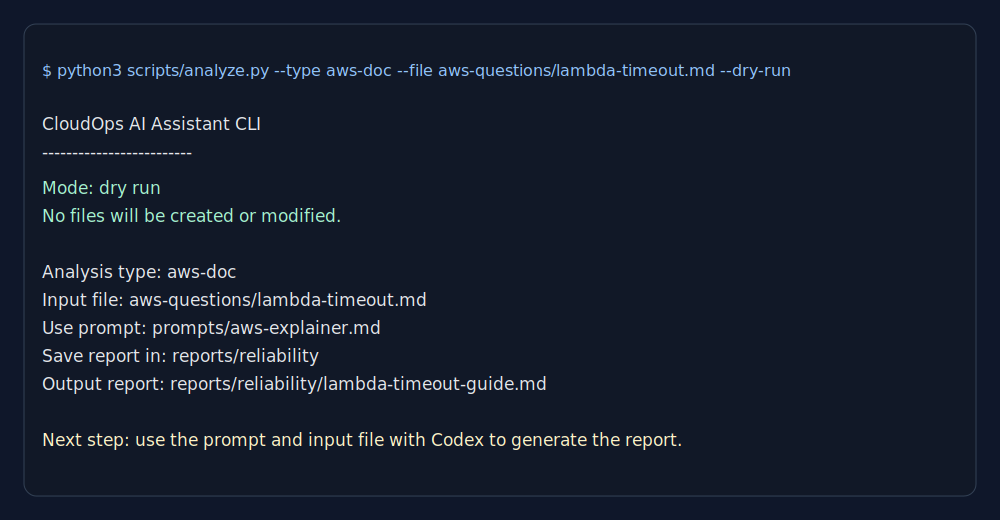
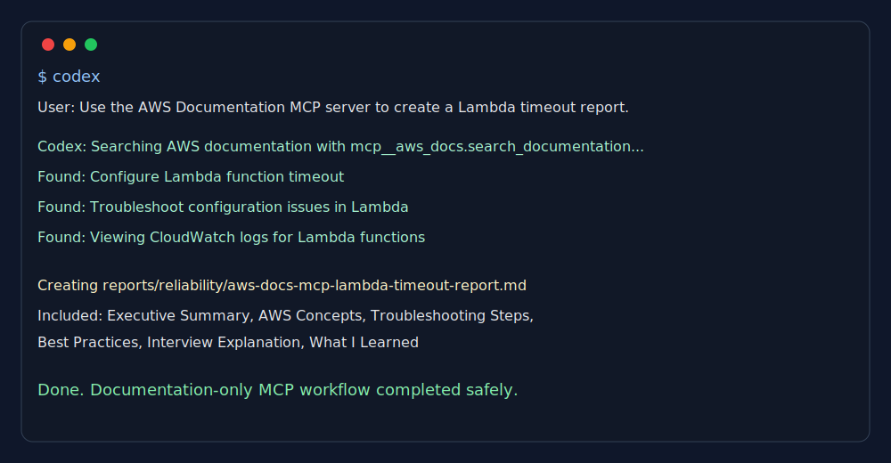
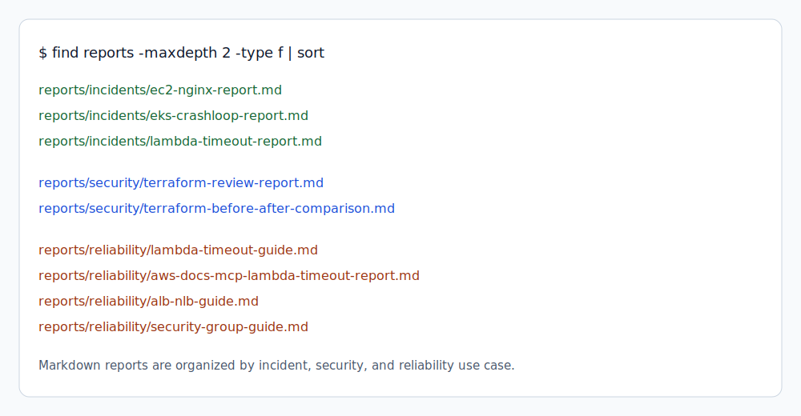
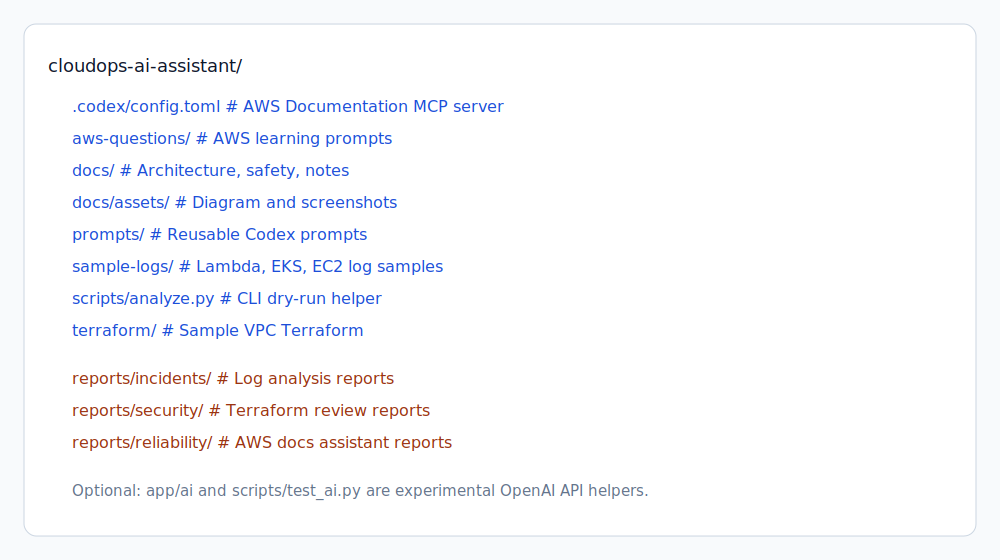

# CloudOps AI Assistant

CloudOps AI Assistant is a portfolio project that shows how Codex, reusable prompts, a small CLI helper, and the AWS Documentation MCP Server can support practical CloudOps work.

The project focuses on safe, read-only workflows: Terraform review, cloud log analysis, AWS concept explanation, documentation-based troubleshooting, and Markdown report generation.

## Architecture


Flow:

1. A user starts with Codex CLI.
2. Codex uses reusable prompts and the local CLI helper to organize the workflow.
3. Inputs come from Terraform files, sample logs, or AWS question files.
4. For AWS documentation tasks, Codex uses the AWS Documentation MCP Server.
5. The final output is a Markdown report under `reports/`.

## Features

- Terraform security and reliability review for sample AWS infrastructure.
- Cloud log analysis for Lambda, EKS, and EC2 incidents.
- AWS documentation assistant for beginner-friendly AWS concept guides.
- AWS Documentation MCP integration for official documentation lookup.
- CLI dry-run helper for mapping inputs to prompts and report paths.
- Markdown reports organized by security, incident, and reliability categories.
- Safety-first workflow with human review before any infrastructure change.

## Tech Stack

- **Codex CLI** for AI-assisted CloudOps workflows.
- **AWS Documentation MCP Server** for official AWS documentation search and reading.
- **Python 3** for the local CLI helper.
- **Markdown** for prompts, reports, architecture notes, and learning notes.
- **Terraform** sample files for infrastructure review practice.
- **CloudWatch-style sample logs** for troubleshooting practice.

Optional/experimental:

- `app/ai/openai_client.py`
- `scripts/test_ai.py`
- `requirements.txt`

These files are not required for the main project workflow. They are kept as optional OpenAI API experiments and may fail if `OPENAI_API_KEY` is missing or the account has no available quota.

## How It Works

The project uses reusable prompts in `prompts/`:

- `prompts/terraform-review.md` reviews Terraform for security, reliability, and maintainability.
- `prompts/log-analysis.md` turns cloud logs into incident reports.
- `prompts/aws-explainer.md` creates AWS concept and troubleshooting guides.

The CLI helper shows the planned workflow without modifying files:

```bash
python3 scripts/analyze.py --type aws-doc --file aws-questions/lambda-timeout.md --dry-run
```

Example dry-run output:



Codex then uses the selected prompt and input file to create or improve reports in `reports/`.

## MCP Integration

This project integrates Codex with the AWS Documentation MCP Server:

```toml
[mcp_servers.aws_docs]
command = "uvx"
args = ["awslabs.aws-documentation-mcp-server@latest"]
```

MCP, or Model Context Protocol, allows an AI assistant to access external tools and documentation through controlled servers. In this project, MCP is used only for documentation access.

Current MCP behavior:

- Search official AWS documentation.
- Read selected AWS documentation pages.
- Use documentation context to improve CloudOps reports.
- Include official AWS references for follow-up review.

Safety boundary:

- No live AWS account inspection.
- No infrastructure changes.
- No Terraform apply.
- No IAM, network, compute, or production actions.

Future versions can add read-only AWS resource inspection, such as listing Lambda configuration or CloudWatch alarm metadata, while still avoiding infrastructure changes.



## Screenshots

Architecture diagram:


Codex using AWS Documentation MCP:


CLI dry-run output:


Generated reports:



Repository structure:



## Reports

Key reports:

- [Terraform review report](reports/security/terraform-review-report.md)
- [Terraform before and after comparison](reports/security/terraform-before-after-comparison.md)
- [Lambda timeout incident report](reports/incidents/lambda-timeout-report.md)
- [EKS CrashLoopBackOff incident report](reports/incidents/eks-crashloop-report.md)
- [EC2 Nginx incident report](reports/incidents/ec2-nginx-report.md)
- [AWS Docs MCP Lambda timeout report](reports/reliability/aws-docs-mcp-lambda-timeout-report.md)
- [Lambda timeout reliability guide](reports/reliability/lambda-timeout-guide.md)

## Repository Structure

```text
cloudops-ai-assistant/
├── .codex/                 # Codex MCP configuration
├── aws-questions/          # AWS concept questions
├── docs/                   # Architecture, safety, learning notes
├── docs/assets/            # Architecture diagram and screenshots
├── prompts/                # Reusable AI prompts
├── reports/                # Generated Markdown reports
│   ├── incidents/
│   ├── reliability/
│   └── security/
├── sample-logs/            # Lambda, EKS, and EC2 sample logs
├── scripts/analyze.py      # CLI dry-run workflow helper
└── terraform/              # Sample Terraform files
```

## Safety Model

The assistant is designed for read-only analysis and human-reviewed recommendations. Infrastructure-changing actions such as applying Terraform, modifying IAM, restarting services, or changing security groups require explicit human approval outside the assistant workflow.

The current working project does not operate on live AWS resources. It uses local files, sample logs, prompts, Markdown reports, and AWS documentation through MCP.

## What I Learned

This project helped demonstrate how AI can support CloudOps work without removing human judgment.

Main lessons:

- AI is useful for first-pass Terraform review, but a human must approve changes.
- Good incident reports depend on evidence from logs, not guesses.
- Reusable prompts make AI-assisted workflows more consistent.
- A CLI dry-run helps keep automation understandable and safe.
- AWS documentation matters because cloud service behavior and limits can change.
- MCP makes an AI assistant more useful by giving it controlled access to external documentation.
- Documentation-only MCP is a safe starting point before adding any live cloud inspection.

More detail is available in [docs/learning-notes.md](docs/learning-notes.md).

## Future Improvements

- Add read-only AWS resource inspection for selected services.
- Add automated report generation from `scripts/analyze.py`.
- Add tests for CLI path selection and validation.
- Add CI checks for Markdown links and formatting.
- Add more AWS troubleshooting scenarios, such as CloudWatch alarms, IAM access denied errors, and VPC networking issues.
- Add optional API-backed report generation when OpenAI API quota is available.

## Status

This project is intentionally lightweight and CLI-focused. The current working demo is Codex + prompts + CLI dry-run + AWS Documentation MCP + Markdown reports.
