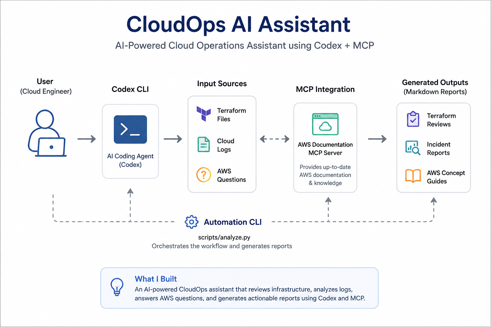

# Architecture

This project is a small, portfolio-friendly AI CloudOps Assistant designed around a command-line workflow. It does not run a web server or expose an API. Instead, the user works with local prompts, sample infrastructure files, sample logs, and generated Markdown reports.

## Workflow

1. Review an operational input such as a Terraform file, CloudWatch-style log, or incident note.
2. Select the relevant prompt from `prompts/`.
3. Use Codex or an AI assistant to analyze the input with the selected prompt.
4. For AWS documentation tasks, use the AWS Documentation MCP Server to retrieve official documentation context.
5. Save the result as a Markdown report under `reports/`.
6. Review the recommendation manually before taking any cloud action.

## Main Components

- `prompts/` contains reusable analysis prompts for Terraform review, log analysis, architecture summaries, and incident reports.
- `sample-logs/` contains example log files that can be used to demonstrate troubleshooting workflows.
- `terraform/` contains sample infrastructure code for review and risk analysis.
- `reports/` contains generated or curated CloudOps outputs.
- `docs/` contains project documentation, safety guidance, and operating notes.
- `.codex/config.toml` configures the AWS Documentation MCP Server for documentation-only lookup.

## CLI-Oriented Design

The assistant is intentionally lightweight. A typical workflow can be run from the terminal by opening files, passing context to Codex, and writing the resulting analysis to Markdown. This keeps the project easy to understand, easy to demonstrate, and suitable for a portfolio without requiring a backend service, container runtime, Kubernetes cluster, or CI pipeline.

## Intended Use Cases

- Terraform configuration review.
- Cloud log analysis.
- Incident summary generation.
- Reliability and security recommendation reports.
- Architecture documentation support.

## Non-Goals

This version does not include FastAPI, Docker, Kubernetes deployment manifests, CI automation, or live AWS resource inspection. Those may be added later if the project grows beyond a portfolio CLI assistant.
